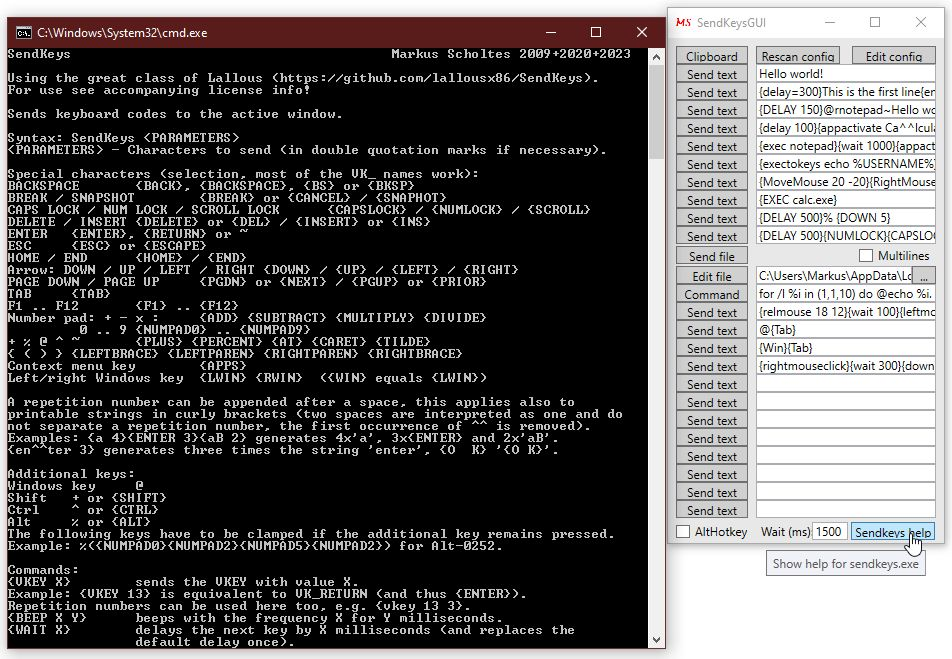

# SendKeysGUI
Keyboard macro tool, sends clipboard, text, file content or command output as keystrokes to the active window.

Graphical front end for the fabulous **[sendkeys](https://github.com/lallousx86/SendKeys) by Elias Bachaalany**.

**Version 2, 2023-05-05**
- first release on github

## Description:
Keyboard macro tool, sends clipboard, text, file content or command output as keystrokes. Hotkeys from Ctrl-^, Ctrl-1 to Ctrl-0 up to Ctrl-' and Ctrl-Shift-^, Ctlr-Shift-1 to Ctrl-Shift-0 up to Ctrl-Shift-' are used to send this text to the active window.
Hotkey modifier can be switched to Alt instead of Ctrl. 

Graphical front end for the fabulous **[sendkeys](https://github.com/lallousx86/SendKeys) by Elias Bachaalany**.

**Important:** SendKeysGUI expects german keyboard layout, the keys ^, ß, ´ might not work on other layout (feedback would be helpful here). A future version will allow custom configuration of the keyboard virtual keys for hotkeys

The delivered sendkeys.exe has additional features:
- sending keys or texts multiple times, e.g. {x 10} or {Text 3}
- APPACTIVATE ignores case and works on partial strings
- {ALT}, {CTRL} und {SHIFT} as alternative to %, ^ and +
- {WAIT ...} instead of {DELAY ...}
- expanded VK_ values
- new commands {EXEC ...}, {EXECWAIT ...} and {EXECTOKEYS ...} 
- mouse control

## Installation:
Copy *SendKeysGUI.exe* and *SendKeys.exe* to a folder of your choice. Start *SendKeysGUI*.

On first start *SendKeysGUI* will copy an existing **config.ini** in the program directory to the configuration folder **%LOCALAPPDATA%\SendKeysGUI**.
If it does not find one, a new one will created there with default and empty entries.
Please select the button **Edit config** to configurate and then **Rescan config** to use the new configuration.

## Generate:
*SendKeysGUI.cs* is a single file C#-WPF source code. Compile with **Compile.bat** (no Visual Studio or MSBuild needed, but a supported version of Windows)

or look for a pre-compiled version in [Releases](https://github.com/MScholtes/SendKeysGUI/Releases).

## Use:
After start SendKeysGUI will register its hotkeys. With the checkbox **AltHotKey** you can switch between Ctrl or Alt as base hotkey modifier.

Please fill the values of the text fields with text macros of your choice in *SendKeys* syntax (click **Sendkeys help** for information).
The corresponding hotkey is shown in the tool tips of the buttons.

The function **Clipboard** sends the text content of the clipboard as keystrokes, **Send file** sends the content of a text file, which can be configured with **Edit file** or the neighbour path field.

Use the buttons **Edit config** to configurate *SendKeysGUI* and then **Rescan config** to use the new configuration.

The value in **Wait (ms):** defines the wait time after clicking a **Send...** button, before the keystrokes are send (does not apply to activation with hotkeys).

The checkbox **Multilines** is rarely of significance, it determins whether a multiline string like "Line1{ENTER}Line2" is processed as single command **sendkeys "Line1{ENTER}Line2"** or as multiple command **sendkeys "Line1{ENTER}"** and a following **sendkeys "Line2"**.
