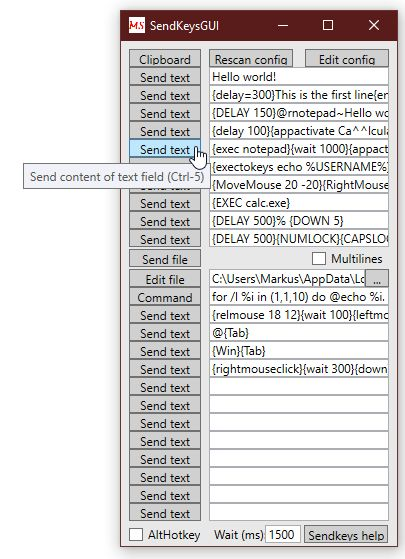
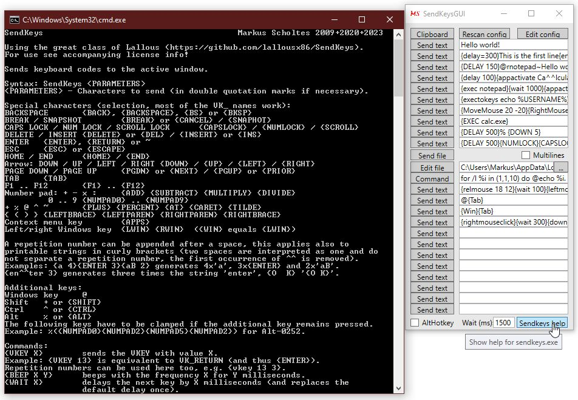

# SendKeysGUI
Keyboard macro tool, sends clipboard, text, file content or command output as keystrokes to the active window.

Graphical front end for the fabulous **[sendkeys](https://github.com/lallousx86/SendKeys) by Elias Bachaalany (lallousx86)**.

### Version 2.2, 2023-08-18
- clipboard function replaces parenthesis with {}-code, comments with {#

## Description:
Keyboard macro tool, sends clipboard, text, file content or command output as keystrokes.

Hotkeys from *Ctrl-<keyleftof1>*, *Ctrl-1* to *Ctrl-0* up to *Ctrl-<keysecondrightof0>* and *Ctrl-Shift-<keyleftof1>*, *Ctrl-Shift-1* to *Ctrl-Shift-0* up to *Ctrl-Shift-<keysecondrightof0>* are used to send this text to the active window.

The syntax for keys is based on the .Net **System.Windows.Forms.SendKeys** class, the hotkey modifier can be switched to *Alt* instead of *Ctrl*.

Graphical front end for the fabulous **[sendkeys](https://github.com/lallousx86/SendKeys) by Elias Bachaalany (lallousx86)**.

The delivered **sendkeys.exe** has additional features:
- sending keys or texts multiple times, e.g. {x 10} or {Text 3}
- APPACTIVATE ignores case and works on partial strings
- {ALT}, {CTRL} und {SHIFT} as alternative to %, ^ and +
- {WAIT ...} instead of {DELAY ...}
- {# ...} as comment
- expanded VK_ values
- new commands {EXEC ...}, {EXECWAIT ...} and {EXECTOKEYS ...}
- mouse control

## Installation:
Copy *SendKeysGUI.exe* and *SendKeys.exe* to a folder of your choice. Start *SendKeysGUI.exe*.

On first start *SendKeysGUI* will copy an existing **config.ini** in the program directory to the configuration folder **%LOCALAPPDATA%\SendKeysGUI**.
If it does not find one, a new one will be created there with default and empty entries.
Please select the button **Edit config** to configurate and then **Rescan config** to use the new configuration.

## Generate:
*SendKeysGUI.cs* is a single file C#-WPF source file. Compile with **Compile.bat** (no *Visual Studio* or *MSBuild* needed, but a supported version of *Windows*)

or look for a pre-compiled version in [Releases](https://github.com/MScholtes/SendKeysGUI/releases).

## Use:
After start *SendKeysGUI* will register its hotkeys. With the checkbox **AltHotKey** you can switch between *Ctrl* and *Alt* as base hotkey modifier.

Please fill the values of the text fields with text macros of your choice in *SendKeys* syntax (click **Sendkeys help** for information).
The corresponding hotkey is shown in the tool tips of the buttons.

The function **Clipboard** sends the text content of the clipboard as keystrokes, **Send file** sends the content of a text file, which can be configured with **Edit file** or the neighbour path field. The button **Command** executes the command line in the textfield next to it with *cmd.exe* and sends its output as keystrokes.

Use the buttons **Edit config** to configurate *SendKeysGUI* and then **Rescan config** to use the new configuration.

The value in **Wait (ms):** defines the wait time after clicking a **Send...** button before the keystrokes are send (does not apply to activation with hotkeys).

The checkbox **Multilines** is rarely of significance, it determins whether a multiline string like "Line1{ENTER}Line2" is processed as single command **sendkeys "Line1{ENTER}Line2"** or as multiple commands **sendkeys "Line1{ENTER}"** and a following **sendkeys "Line2"**.
